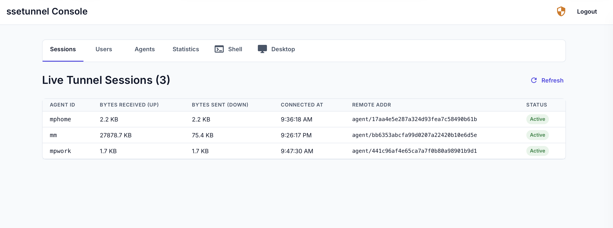
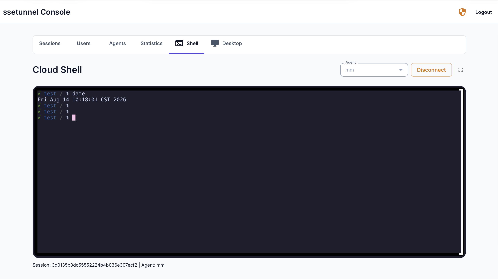
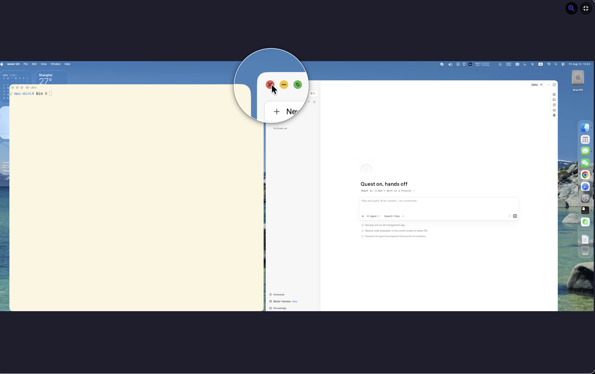

# ssetunnel

**Expose private TCP services through a public server — over HTTP.**

SSH into machines behind corporate firewalls. Forward VNC, databases, any TCP port. No inbound rules, no VPN, no port forwarding. Just outbound HTTP.

```
ssh -o ProxyCommand="ssetunnel connect --base /sse --server https://www.yourserver.com --agent mm --target 127.0.0.1:22 --local -" your_ssh_user@127.0.0.1
```

That's it. One command. You're in.

---

## How It Works

Your **agent** (on the private machine) dials *out* to the public server over plain HTTP. Your **client** dials *in* from anywhere. The server multiplexes them together using yamux over an SSE-down + batched-POST-up transport.

Firewalls see nothing but outbound HTTPS. No inbound ports. No TCP tunnels on the wire.

```
You (SSH, DB client, VNC …)
  │
  ▼
┌──────────────┐       HTTP (SSE + POST)       ┌──────────────┐       TCP / PTY       ┌──────────────┐
│   connect    │ ◄══════════════════════════►  │    server    │ ◄══════════════════►  │    agent     │
└──────────────┘        public internet        └──────────────┘    private network    └──────────────┘
                                                                                             │
                                                                                             ▼
                                                                                       sshd / DB / VNC
```

> For the full architecture deep-dive, service management, and production deployment guide, see [overview.md](overview.md).

---

## In Action

**Live tunnel sessions** — monitor every connected agent, bandwidth, and connection in real time from the web console.



**Cloud Shell** — jump straight into a terminal on any connected agent from your browser. No SSH client needed.



**Remote Desktop** — view remote desktop from any connected agent from your browser. No remote desktop client needed.


**Your agent, your network** — the agent runs on the private machine and forwards traffic to local services (sshd, VNC, databases, anything listening on TCP).

---

## Quick Start

### 1. Start the server (local dev, no auth)

```bash
ssetunnel server run --disable-auth
```

### 2. Run an agent on the private machine

```bash
ssetunnel agent run --server http://127.0.0.1:8080 --target 127.0.0.1:22 --id mybox
```

### 3. SSH through the tunnel

```bash
ssh -o ProxyCommand="ssetunnel connect --server http://127.0.0.1:8080 --agent mybox --target 127.0.0.1:22 --local -" user@127.0.0.1
```

Or forward any TCP port (e.g. VNC on `:5900`):

```bash
ssetunnel connect --server http://127.0.0.1:8080 --agent mybox --target 127.0.0.1:5900 --local 127.0.0.1:5900
```

---

## Production (Behind a Reverse Proxy)

Deploy the server on a public VPS behind Caddy:

```caddyfile
https://tunnel.example.com {
    reverse_proxy /sse*     http://127.0.0.1:8080
    reverse_proxy /console* http://127.0.0.1:8081
    file_server
}
```

Start as a managed OS service (systemd / launchd):

```bash
# Server (public VPS)
ssetunnel server start --base /sse --db-url "postgres:embedded:?datapath=$HOME/.ssetunnel/data"

# Agent (private machine) — login once, then start
ssetunnel login --server https://tunnel.example.com
ssetunnel agent start --id office --base /sse

# Client (anywhere) — SSH in
ssetunnel login --server https://tunnel.example.com
ssh -o ProxyCommand="ssetunnel connect --base /sse --server https://tunnel.example.com --agent office --target 127.0.0.1:22 --local -" user@127.0.0.1
```

---

## What Can You Tunnel?

| Use Case | Command |
|----------|---------|
| **SSH** | `ssh -o ProxyCommand="ssetunnel connect --agent mybox --target 127.0.0.1:22 --local -" user@host` |
| **VNC / RDP** | `ssetunnel connect --agent mybox --target 127.0.0.1:5900 --local 127.0.0.1:5900` |
| **Database** | `ssetunnel connect --agent mybox --target 127.0.0.1:5432 --local 127.0.0.1:15432` |
| **Any TCP** | `ssetunnel connect --agent mybox --target <host>:<port> --local <host>:<port>` |

---

## Further Reading

- [Full Architecture & Deployment Guide](overview.md) — detailed setup, service management, auth modes, and production tips
- [CHANGELOG.md](CHANGELOG.md) — release notes

---

## License

`ssetunnel` is released under the MIT License.
